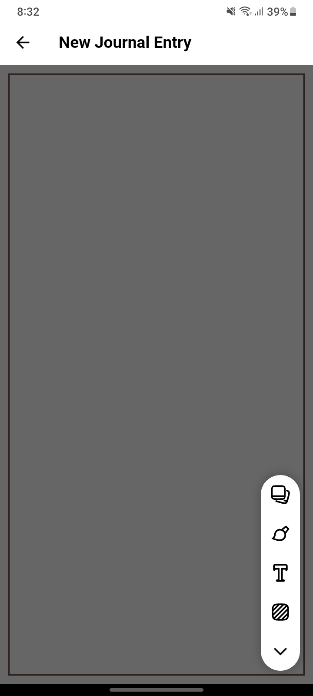
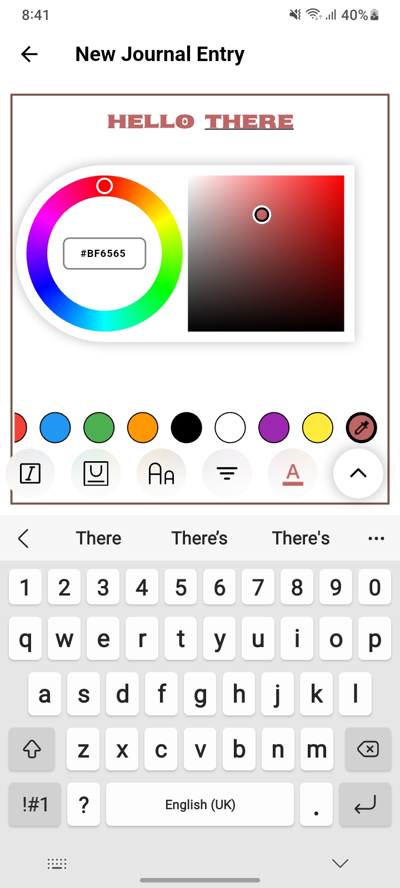
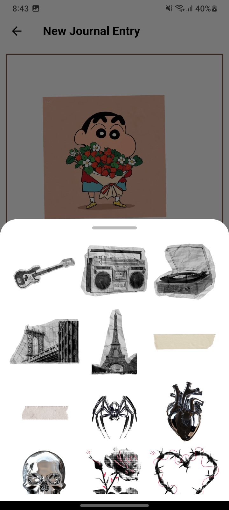
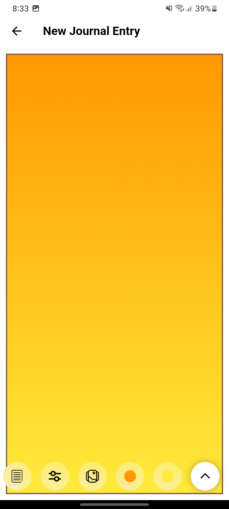
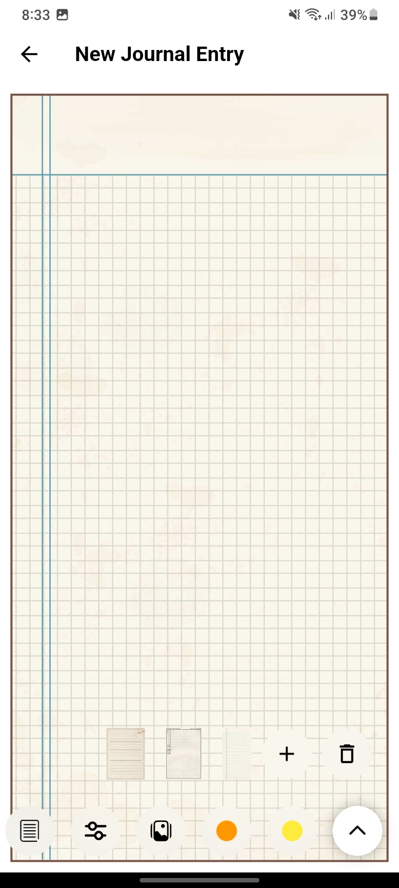
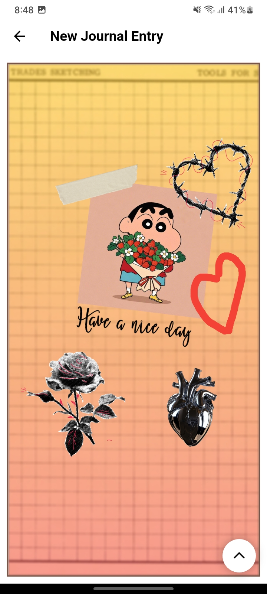

# 📸 Polaroid Journal

A creative Flutter app for designing aesthetic, scrapbook-style journal pages. Polaroid Journal gives you a blank canvas to express yourself — add images, stickers, text, and drawings on top of beautiful backgrounds to create pages that feel uniquely yours.

> ⚠️ This project is currently in active development. Core features are functional. Save and export features are coming soon.

---

##  Features

###  Images
- Pick images from your gallery and place them on the canvas
- Freely move, rotate, and scale with touch gestures

###  Text
- Add text anywhere on the canvas
- Choose from 8 built-in fonts: KrabbyPatty, Abril Fatface, Akira, Apple Garamond, Moonlight, Open Sans, Sekuya, and Ransom Note
- Customize color, size, alignment, italic, and underline

###  Custom Color Picker
- Fully custom-built color picker UI
- Hue ring selector
- Saturation and brightness square
- Hex code input
- Preset color swatches
- Eyedropper tool

###  Drawing
- Freehand drawing directly on the canvas
- Powered by the `whiteboard` package

###  Backgrounds
- Solid color backgrounds
- Gradient backgrounds
- Image backgrounds
- Aesthetic paper textures (grid, lined, plain, and more)

###  Stickers
- 16 built-in aesthetic stickers
- Accessible from a bottom sheet panel
- Moveable, rotatable, and scalable just like images

---

## Screenshots

| | | |
|---|---|---|
|  |  |  |
|  |  |  |

---

##  Tech Stack

| Package | Purpose |
|---|---|
| `image_picker` | Pick images from gallery |
| `flutter_quill` | Rich text editing |
| `whiteboard` | Freehand drawing canvas |
| `flutter_colorpicker` | Base for custom color picker |
| `flutter_speed_dial` | Floating action button menu |
| `flutter_svg` | SVG asset rendering |

**Custom Built:**
- Color picker UI (hue ring + saturation/brightness square + hex input)
- Gesture handler for move/rotate/scale on canvas elements
- Background selector with solid, gradient, image, and texture options

---

##  Getting Started

### Prerequisites
- Flutter SDK `^3.9.2`
- Android Studio or VS Code
- Android or iOS device/emulator

### Installation

```bash
# Clone the repo
git clone https://github.com/ShirishDawadi/Polaroid_Journal.git

# Navigate to project directory
cd Polaroid_Journal

# Install dependencies
flutter pub get

# Run the app
flutter run
```

---

##  Roadmap

- [ ] Save journal entries locally
- [ ] Export canvas as PNG / JPEG / PDF
- [ ] More sticker packs
- [ ] Page templates

---

##  Author

**Shirish Dawadi**
[GitHub](https://github.com/ShirishDawadi) • [Email](mailto:shirishdawadi1@gmail.com)
