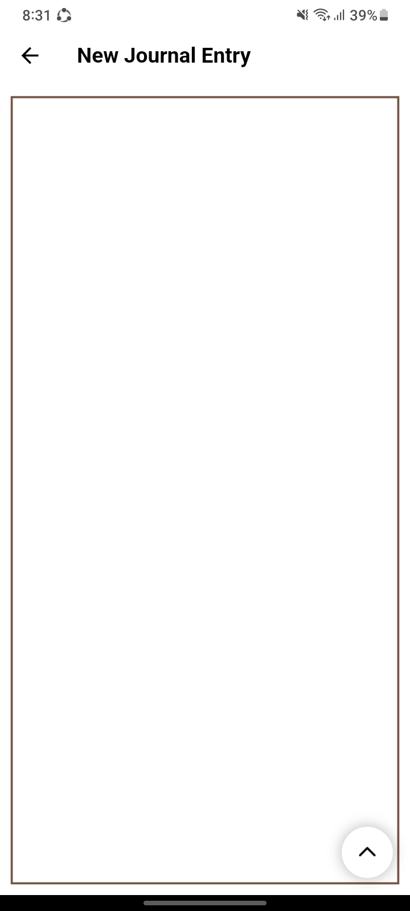
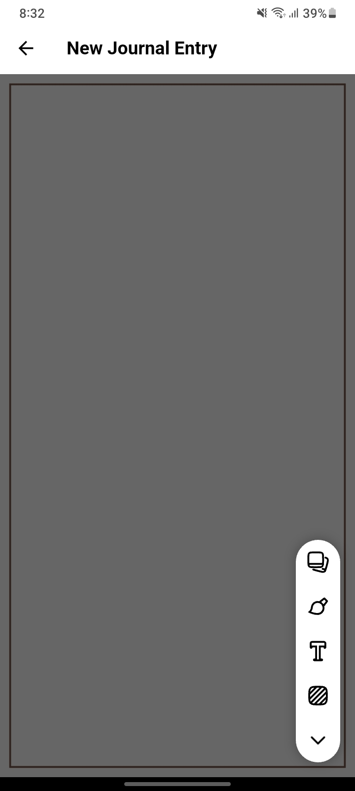
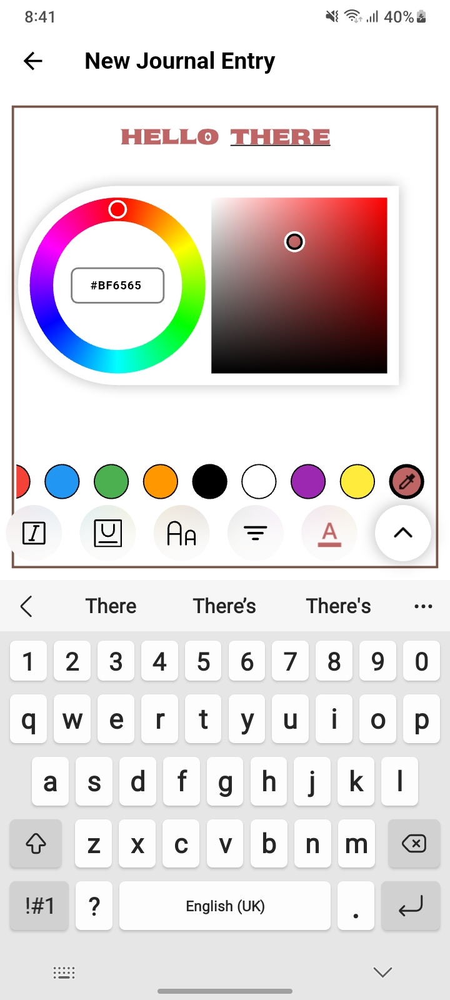
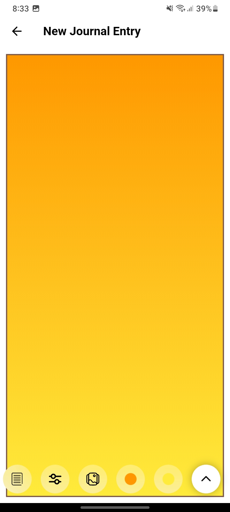
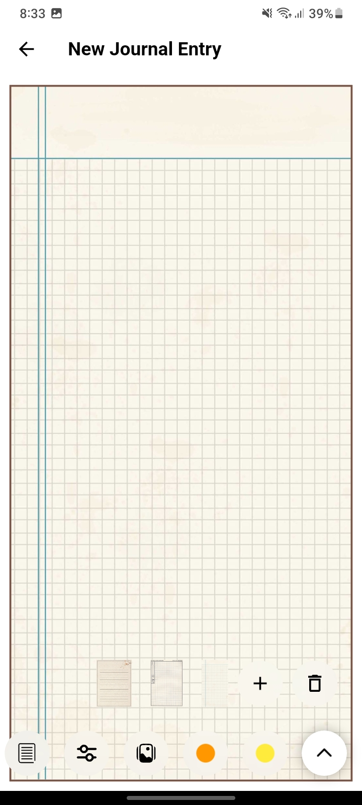
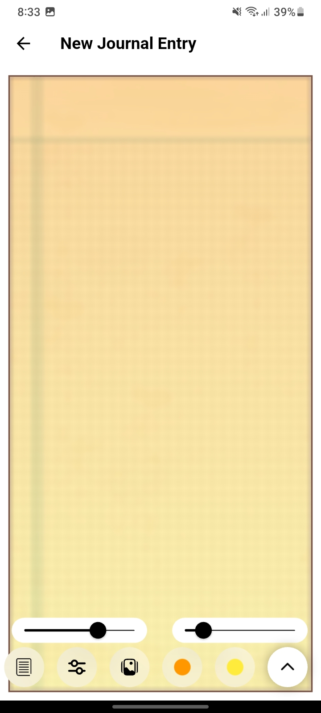
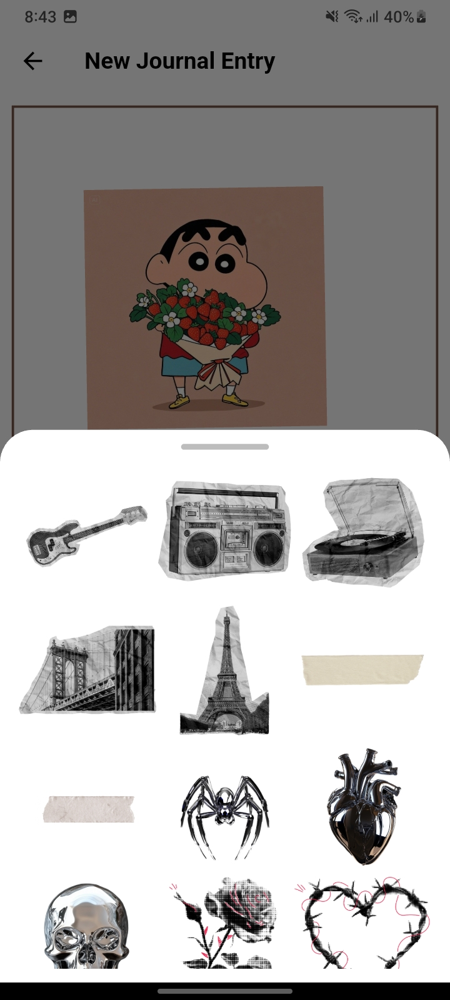
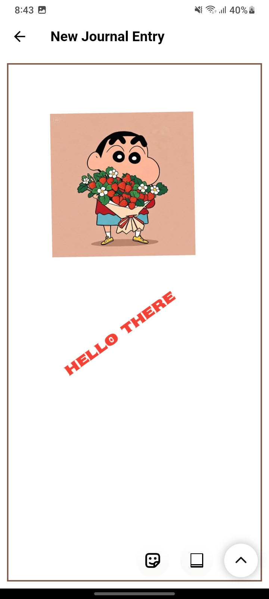
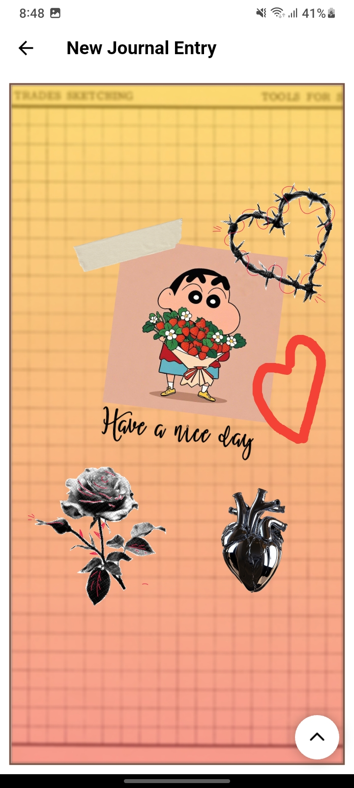

# 📸 Polaroid Journal

> A creative Flutter app for designing aesthetic, scrapbook-style journal pages.

Polaroid Journal gives you a blank canvas to express yourself — layer photos, stickers, freehand drawings, and styled text on top of beautiful backgrounds to create pages that feel uniquely yours.

> ⚠️ This project is currently in active development. Save and export features are coming soon.

---

## ✨ Features

### 🖼️ Images
- Pick images from your gallery and place them on the canvas
- Move, rotate, and scale freely with touch gestures

### ✍️ Text
- Add text anywhere on the canvas
- Choose from 8 built-in fonts: **KrabbyPatty**, **Abril Fatface**, **Akira**, **Apple Garamond**, **Moonlight**, **Open Sans**, **Sekuya**, and **Ransom Note**
- Customize color, size, alignment, italic, and underline styling

### 🎨 Custom Color Picker
- Fully custom-built color picker UI
- Hue ring selector + saturation/brightness square
- Hex code input and preset color swatches
- Eyedropper tool

### ✏️ Drawing
- Freehand drawing directly on the canvas
- Adjustable brush size and color
- Eraser support

### 🖼️ Backgrounds
- Solid color and gradient backgrounds
- Image backgrounds from gallery
- Aesthetic paper textures (grid, lined, plain, vintage)
- Real-time blur and opacity sliders

### 🪄 Stickers
- 16 built-in aesthetic stickers (roses, skulls, boombox, anatomical heart, barbed wire, and more)
- Accessible from a scrollable bottom sheet panel
- Moveable, rotatable, and scalable just like images

---

## 📸 Screenshots

| Blank Canvas | Tool Menu | Custom Color Picker |
|:---:|:---:|:---:|
|  |  |  |

| Gradient Background | Paper Texture | Bg Blur & Opacity |
|:---:|:---:|:---:|
|  |  |  |

| Sticker Sheet | Image Layer | Finished Page |
|:---:|:---:|:---:|
|  |  |  |

---

## 🏗️ Architecture

This project follows **MVVM (Model-View-ViewModel)** with **Riverpod 2.x** for state management.

```
lib/
├── core/
│   ├── constants/        # App-wide asset paths
│   ├── theme/            # Material 3 theme config
│   └── utils/            # Enums (Tool, SubTool, LayerType)
│
├── data/
│   └── models/
│   │   ├── journal_state.dart        # Immutable app state
│       └── layer_model.dart          # Immutable data model for each canvas layer
│
├── presentation/
│   ├── viewmodels/
│   │   └── journal_viewmodel.dart    # JournalNotifier — all business logic lives here
│   ├── views/
│   │   ├── home.dart                 # Entry screen
│   │   └── journal_entry.dart        # Main canvas screen
│   └── widgets/
│       ├── color_picker/             # Custom hue/saturation/hex color picker
│       ├── floatingBars/             # Collapsible FAB tool menus
│       ├── layer/                    # MovablePhoto, MovableTextField, DrawingLayer
│       ├── journal_background.dart   # Background renderer
│       └── stickers_bottom_sheet.dart
│
└── main.dart             # Wrapped in ProviderScope
```

**Key design decisions:**
- `LayerModel` is the atomic unit of the canvas — every photo, sticker, text block, and drawing is a layer
- `JournalState` is immutable; all updates use `copyWith` to produce a new state
- `JournalNotifier` is the single source of truth for all layer operations — no business logic in the UI
- Views are `ConsumerStatefulWidget` and only call notifier methods; they never mutate state directly

---

## 🛠️ Tech Stack

| Package | Purpose |
|---|---|
| `flutter_riverpod` | State management (Notifier + AsyncNotifier pattern) |
| `image_picker` | Pick images from device gallery |
| `whiteboard` | Freehand drawing canvas |
| `flutter_svg` | SVG sticker rendering |
| `flutter_speed_dial` | Collapsible floating action button menu |

**Custom built (no package dependency):**
- Color picker UI — hue ring, saturation/brightness square, hex input, eyedropper
- Gesture handler for move/rotate/scale on every canvas layer
- Background system — solid color, gradient, image, paper textures, blur/opacity

---

## 🚀 Getting Started

### Prerequisites
- Flutter SDK `^3.9.2`
- Android Studio or VS Code
- Android or iOS device / emulator

### Installation

```bash
# Clone the repository
git clone https://github.com/ShirishDawadi/Polaroid_Journal.git

# Navigate into the project
cd Polaroid_Journal

# Install dependencies
flutter pub get

# Run the app
flutter run
```

---

## 🗺️ Roadmap

- [ ] Save journal entries locally (Isar / SQLite)
- [x] Export canvas as PNG 
- [ ] Home screen gallery — view all saved journals
- [ ] More sticker packs
- [ ] Page templates
- [ ] Performance optimization with `RepaintBoundary`

---

## 👤 Author

**Shirish Dawadi**  
[GitHub](https://github.com/ShirishDawadi) · [Email](mailto:shirishdawadi1@gmail.com)
